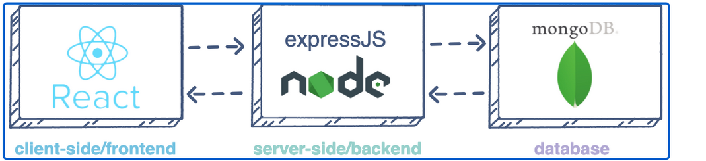
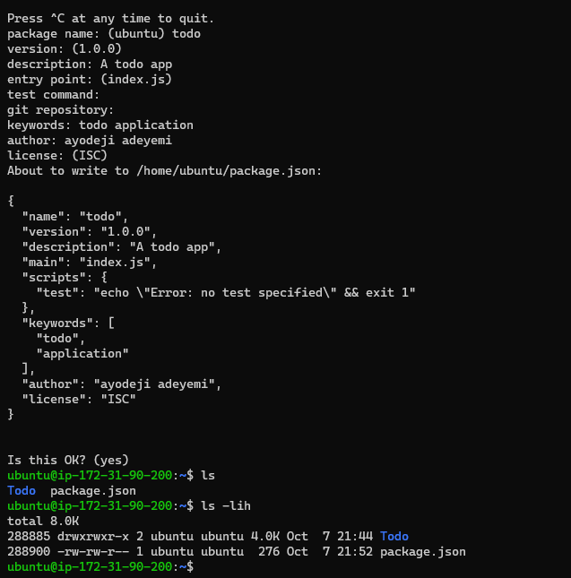

# Project_03

**Simple To-Do application on MERN Web Stack**

- This project is tasked to implement a web solution based on MERN stack in AWS Cloud using follwoing components MongoDB,ExpressJS,ReactJS,NodeJS:

1. MongoDB: A document-based, No-SQL database used to store application data in a form of documents.
2. ExpressJS: A server side Web Application framework for Node.js.
3. ReactJS: A frontend framework developed by Facebook. It is based on JavaScript, used to build User Interface (UI) components.
4. Node.js: A JavaScript runtime environment. It is used to run JavaScript on a machine rather than in a browser.

- [x] a user interacts with the ReactJS UI components at the application front-end residing in the browser.
- [Y] This frontend is served by the application backend residing in a server, through ExpressJS running on top of NodeJS.
- [Z] a data change request is sent to the NodeJS based Express server, which grabs data from the MongoDB database if required, and returns the data to the frontend of the application, which is then presented to the user.

**Project_03_Begins**

## Backend Configuration

- Update ubuntu:

`sudo apt update`

- Upgrade ubuntu:

`sudo apt upgrade`

- Lets get the location of Node.js software from Ubuntu repositories:

`curl -fsSL https://deb.nodesource.com/setup_18.x | sudo -E bash -`

- Install Node.js on the server:

`sudo apt-get install -y nodejs`

- Verify the node installation with the command below:

`node -v`

`npm -v`

**Application_Code_Setup**

- Create a new directory for your To-Do project:

`mkdir Todo`

- Run the command below to verify that the Todo directory is created with ls command:

`ls`

- Now change your current directory to the newly created one:

`cd Todo`

- To initialise your project:

`npm init`

